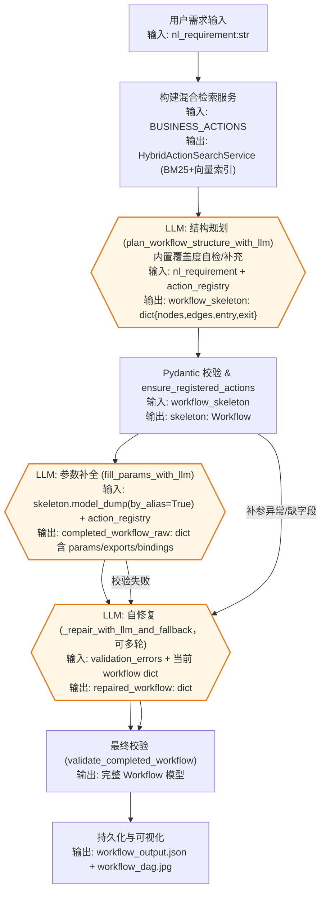

# VelvetFlow

VelvetFlow 是一个可复用的 LLM 驱动工作流规划与执行演示项目。项目包含混合检索、两阶段 LLM 规划（结构 + 补参）、静态校验与自修复、参数绑定 DSL、可模拟执行器与 DAG 可视化，帮助从自然语言需求自动构建并运行业务流程。

## 项目结构
```
VelvetFlow (repo root)
├── velvetflow/
│   ├── action_registry.py       # 从 business_actions.json 读取动作，附加安全元数据
│   ├── bindings.py              # 参数绑定 DSL 解析/校验
│   ├── business_actions.json    # HR/OPS/CRM 等示例动作库
│   ├── config.py                # 默认 OpenAI 模型配置
│   ├── executor.py              # 动态执行器，支持条件/循环/聚合导出
│   ├── logging_utils.py         # 终端友好日志 & 事件日志
│   ├── loop_dsl.py              # loop 节点 exports 输出 Schema 辅助
│   ├── models.py                # Workflow/Node/Edge 强类型模型与校验
│   ├── planner/                 # 结构规划、补参与自修复模块
│   ├── verification/            # 规划/更新/执行共享的静态校验模块
│   ├── search.py                # Fake ES + 内存向量库的混合检索服务
│   ├── simulation_data.json     # 执行动作的模拟返回模板
│   └── visualization.py         # 将 workflow 渲染为 JPEG DAG
├── build_workflow.py                  # 端到端生成 + 可视化示例入口
├── execute_workflow.py                 # 从已保存 JSON 执行 workflow
└── LICENSE
```

## 核心能力
- **业务动作注册表**：`action_registry.py` 从 `business_actions.json` 载入动作，自动补齐 `requires_approval` / `allowed_roles` 安全字段，并提供 `get_action_by_id` 查询。
- **混合检索**：`search.py` 提供 `FakeElasticsearch`（基于关键词计分）、`VectorClient`（余弦相似度）以及 `embed_text_openai`。`HybridActionSearchService` 将 BM25 与向量分数归一化后加权融合，返回动作候选。
- **工作流规划 Orchestrator**：`planner/orchestrator.py` 实现两阶段 `plan_workflow_with_two_pass`：
  - 调用 `planner/structure.py` 使用 OpenAI tool-calling 规划结构，并通过覆盖度检查、自动补边/修补循环 exports、审批节点检查等提升连通性与完备性。
  - 使用 `planner/params.py` 补全必填参数（含参数绑定示例），若失败则进入 `planner/repair.py` 与 `planner/action_guard.py` 的 LLM 自修复与动作校验。
  - `verification/validation.py` 做最终静态校验（必填字段、节点连通性、Schema 对齐）；失败则多轮调用修复直到通过或达到上限。
- **DSL 模型与校验**：`models.py` 定义 Node/Edge/Workflow，并校验节点类型、边引用合法性、loop 子图 Schema 等；提供 `ValidationError` 以在修复阶段统一描述错误。
- **参数绑定 DSL**：`bindings.py` 支持 `__from__` 引用上游结果，`__agg__` 支持 `identity/count/count_if/format_join/filter_map/pipeline`，并校验引用路径是否存在于动作输出/输入或 loop exports。
- **执行器**：`executor.py` 的 `DynamicActionExecutor` 会先校验 action_id 是否在注册表中，再执行拓扑排序确保连通；支持 condition 节点（如 list_not_empty/equals/contains/greater_than/between 等）与 loop 节点（body_subgraph + exports.items/aggregates 收集迭代与聚合结果），并结合 `simulation_data.json` 模拟动作返回。日志输出使用 `logging_utils.py`。
- **可视化**：`visualization.py` 提供 `render_workflow_dag`，支持 Unicode 字体回退，将 Workflow 渲染为 JPEG DAG。

## 使用方法
1. **安装依赖**
   ```bash
   python -m venv .venv
   source .venv/bin/activate
   pip install --upgrade openai numpy pillow pydantic
   ```
2. **设置凭证**
   ```bash
   export OPENAI_API_KEY="<your_api_key>"
   ```
3. **运行端到端示例**
   ```bash
   python build_workflow.py
   ```
   - 按提示输入自然语言需求（或直接回车使用默认示例），程序将构建混合检索服务、两阶段规划工作流，并打印最终 DSL。
   - 结果会持久化到 `workflow_output.json`，并生成 `workflow_dag.jpg`。
4. **从已保存 JSON 执行工作流**
   ```bash
   python execute_workflow.py --workflow-json workflow_output.json
   ```
   - 执行器会解析绑定 DSL、运行条件/循环节点，并使用 `velvetflow/simulation_data.json` 生成模拟结果。
5. **从 JSON 绘制工作流 DAG**
   ```bash
   python render_workflow_image.py --workflow-json workflow_output.json --output workflow_dag.jpg
   ```
   - 读取已有的 workflow JSON，将 DAG 渲染成 JPEG。对于 action 节点，会额外显示调用的工具名称和输入参数。
6. **校验任意 workflow JSON（可选）**
   ```bash
   python validate_workflow.py path/to/workflow.json --action-registry velvetflow/business_actions.json --print-normalized
   ```
   - 复用规划阶段的静态规则与 Pydantic 校验，输出详细错误；`--print-normalized` 可打印归一化后的 DSL。
7. **在现有 workflow 上迭代需求（可选）**
   ```bash
   python update_workflow.py path/to/workflow.json --requirement "新增审批环节" --output workflow_updated.json
   ```
   - 将自然语言需求与现有 workflow 作为输入，调用 LLM 自动更新节点、参数与边；若校验失败会将错误列表反馈给 LLM 自动修复（最多 3 轮），最终写入通过校验的结果到 `--output` 指定的文件。

## 工作流构建流程（含 LLM 标注）
下面先将原本的一步式描述拆分为更细的流水线，再用流程图展示端到端构建：

1. **需求接收与环境准备**：获取自然语言需求，并加载业务动作库以初始化混合检索服务。
2. **结构规划 + 覆盖度校验（LLM）**：调用 `plan_workflow_structure_with_llm` 通过 `planner/tools.py` 提供的工具集多轮构建 `nodes/edges/entry/exit` 骨架。每当模型调用 `finalize_workflow` 时会立即触发 `check_requirement_coverage_with_llm`，如果发现 `missing_points` 会将缺失点和当前 workflow 以 system 消息反馈给模型，继续使用 `PLANNER_TOOLS` 修补直至覆盖或达到 `max_coverage_refine_rounds` 上限。【F:velvetflow/planner/structure.py†L631-L960】【F:velvetflow/planner/tools.py†L1-L107】【F:velvetflow/planner/coverage.py†L13-L118】
3. **参数补全（LLM）**：在已通过的骨架上调用 `fill_params_with_llm` 补齐各节点 `params/exports/bindings`，生成完整的工作流字典。
4. **多轮校验与自修复（LLM）**：
   - 首次校验未通过时，记录 `ValidationError` 列表。
   - 进入 `_repair_with_llm_and_fallback`，结合错误提示反复修复，必要时回退到上一次有效版本，直到通过或达到 `max_repair_rounds`。
5. **持久化与可视化**：最终通过校验后，写出 `workflow_output.json`，并可用 `render_workflow_image.py` 生成 `workflow_dag.jpg`。

下方流程图标明关键输入/输出与 LLM 节点：



LLM 相关节点说明：
- **结构规划**：基于自然语言需求与动作 schema，生成 `nodes/edges/entry/exit` 的骨架。规划阶段会使用预置的工具集（添加节点/边、设置入口出口、修改 meta 信息等），模型通过 tool-calling 自动选择，所有调用结果会以日志形式保存，便于复现或对照失败案例。【F:velvetflow/planner/structure.py†L337-L451】
- **覆盖度检查**：在结构规划阶段，当模型调用 `finalize_workflow` 时会立即对照自然语言需求触发覆盖度检查；若出现 `missing_points` 会把缺失点和当前 workflow 反馈给模型，让其继续用规划工具补齐后再次 finalize，直至覆盖或达到补全上限。【F:velvetflow/planner/structure.py†L631-L960】【F:velvetflow/planner/coverage.py†L13-L118】
- **参数补全**：为每个 action/condition/loop 节点填充必需的 `params`、`exports` 与绑定表达式，模型由 `velvetflow.config.OPENAI_MODEL` 控制。
- **自修复**：当校验失败或补参异常时，使用当前 workflow 字典与 `ValidationError` 列表提示模型修复，直到通过或达到 `max_repair_rounds`。

### Tool-calling 的设计与技术细节
- **工具清单与参数规范**：规划阶段暴露给 LLM 的工具集中定义在 `planner/tools.py`，包含元数据设置、业务动作检索、节点增删以及结束标记，共同组成结构规划的“编辑指令集”。每个工具都给出了 JSON Schema 约束，帮助模型生成可解析的参数；其中 `search_business_actions` 返回 candidates 列表，后续 `add_action_node` 只能在该候选集里选择 action_id，强制动作来自注册表。【F:velvetflow/planner/tools.py†L1-L192】
- **系统提示词与回合驱动**：`plan_workflow_structure_with_llm` 会构造包含硬性约束的 system prompt，强调必须围绕用户需求逐步覆盖触发/查询/筛选/总结/通知等子任务，并在循环节点外部只能引用 `loop.exports`。随后以多轮对话驱动 tool-calling，默认温度 0.2、`tool_choice="auto"`，模型在调用 `finalize_workflow` 后会收到覆盖度缺失的 system 反馈并继续补齐。【F:velvetflow/planner/structure.py†L305-L375】【F:velvetflow/planner/structure.py†L631-L960】
- **工具执行与防御式校验**：每轮返回的 tool_calls 会被逐个解析 JSON 参数并分派执行：
  - 动作检索会更新 `last_action_candidates`，用来限定后续 action 节点的合法 ID；若未先检索或 ID 不在候选集中，会返回错误结果继续对话，防止幻觉动作写入工作流。【F:velvetflow/planner/structure.py†L376-L438】
  - 节点/边增删最终通过 `WorkflowBuilder` 汇总到 skeleton；解析失败时会记录错误并附带 `tool_call_id`，便于模型在下一轮修正。【F:velvetflow/planner/structure.py†L341-L449】
  - 在 `finalize_workflow` 触发覆盖度缺失时，会通过 tool 回执与 system 提示反馈缺失点，允许模型继续使用相同的规划工具补齐骨架。【F:velvetflow/planner/structure.py†L631-L960】
- **日志与可复现性**：每次调用都会使用 `log_info/log_error/log_event` 记录函数名与参数，LLM 返回的 `messages` 会完整保留 tool 调用及结果，覆盖度检查反馈同样会写入日志，方便重放或定位失败的阶段。【F:velvetflow/planner/structure.py†L327-L960】

## 循环节点的处理细节
为方便开发者定位循环相关逻辑，补充 loop 的运行与导出细节：

- **定义与校验**：`models.py` 会检查 loop 的 `iter` 路径、`body_subgraph` 的拓扑完整性，以及 `exports` 的 `items/aggregates` 是否声明了引用名，未通过会在规划阶段直接报错，避免运行时才失败。【F:velvetflow/models.py†L70-L92】
- **DSL 辅助 Schema**：`loop_dsl.py` 定义了 loop 节点 exports 的 Pydantic 模型，确保 `items`（逐轮收集）与 `aggregates`（汇总）字段结构一致。【F:velvetflow/loop_dsl.py†L1-L96】
- **执行阶段**：`executor.DynamicActionExecutor` 在遇到 loop 节点时会展开 `iter` 集合，依次执行 `body_subgraph`，将每轮输出写入 `loop_context`。子图可以引用 `loop.item`/`loop.index`，并在循环结束后依据 `exports.items/aggregates` 聚合到上层节点上下文。【F:velvetflow/executor.py†L187-L281】【F:velvetflow/bindings.py†L206-L341】

## 自定义与扩展
- **扩展动作库**：编辑 `velvetflow/business_actions.json` 增加/调整动作，`action_registry.py` 会自动加载并附加安全字段。
- **调优检索**：在 `build_workflow.py` 的 `build_default_search_service` 调整 `alpha` 或替换 `DEFAULT_EMBEDDING_MODEL`/`embed_text_openai` 以适配自定义向量模型。
- **更换模型**：`velvetflow/config.py` 中的 `OPENAI_MODEL` 控制规划/补参阶段使用的 OpenAI Chat 模型。
- **定制执行行为**：修改 `velvetflow/simulation_data.json` 模板以覆盖动作返回；如需调整条件/循环聚合规则，可在 `executor.py` 与`bindings.py` 中扩展。

## Workflow DSL 速查
下面的 JSON 结构是 VelvetFlow 规划/执行都遵循的 DSL。理解这些字段有助于手写、调试或修复 LLM 产出的 workflow。

### 顶层结构
```jsonc
{
  "workflow_name": "可选: 业务流程名称",
  "description": "可选: 描述",
  "nodes": [ /* 节点数组，详见下文 */ ],
  "edges": [ /* 有向边数组，详见下文 */ ]
}
```
- `nodes`/`edges` 会经由 Pydantic 强类型校验，重复的 `id`、边引用不存在的节点或自环都会报错。【F:velvetflow/models.py†L44-L92】

### 节点定义（nodes）
每个节点都包含以下字段：

```jsonc
{
  "id": "唯一字符串",
  "type": "start|end|action|condition|loop|parallel",
  "action_id": "仅 action 节点需要，对应 business_actions.json 中的 id",
  "display_name": "可选: 用于可视化/日志的友好名称",
  "params": { /* 取决于节点类型的参数，下文详述 */ }
}
```

- **start/end**：只需 `id` 与 `type`，`params` 可为空。常作为入口/出口。
- **action**：`action_id` 必填；`params` 按动作的 `arg_schema` 填写，支持绑定 DSL（见下文）。
- **condition**：`params` 中通常包含 `source`（绑定路径或常量）、`op`（如 equals、greater_than）、`value`（对比值）。未通过条件的边可在 `edges[].condition` 标注 `false`。
- **loop**：`params` 需要 `iter`（循环目标，如 `result_of.fetch.items`）、`body_subgraph`（子图，结构同顶层 workflow）、`exports`（定义每轮的收集字段与聚合规则）。`body_subgraph` 在解析时也会按完整 Workflow 校验，字段不合法会提前报错。【F:velvetflow/models.py†L70-L92】
- **parallel**：用于并行分支的占位节点，通常没有额外参数。

### 边定义（edges）
```jsonc
{
  "from": "上游节点 id",
  "to": "下游节点 id",
  "condition": "可选: 字符串条件标记 ("true"/"false" 或业务含义)",
  "note": "可选: 人类可读备注"
}
```
- `condition` 支持布尔值，解析时会被归一化为字符串，便于 LLM 输出直接通过校验。【F:velvetflow/models.py†L31-L68】

### 参数绑定 DSL（params 内的占位符）
执行器会对 `params` 里的绑定表达式进行解析与类型校验，核心形态为：

```jsonc
"some_param": {"__from__": "result_of.nodeA.output.field", "__agg__": "identity"}
```

常用能力：
- `__from__`: 必填，指向上游结果或循环上下文，形如 `result_of.<node_id>.<path>`。如果节点是 loop，还可以写 `loop.item` 或 `loop.index`。
- `__agg__`: 聚合/变换方式，默认 `identity`。支持：
  - `count` / `count_if`：统计列表长度，`count_if` 还能用 `field`+`op`+`value` 过滤。
  - `join`: 直接用 `separator`（或 `sep`）把字符串列表拼接成一个字符串。
  - `format_join`: 将列表/单值按 `format` 模板渲染并用 `sep` 拼接，`format` 中应直接写字段名占位符（如 `{name}`、`{score}`），不再支持 `{value}`。
  - `filter_map`: 先过滤再映射/格式化，适合从列表提取子字段并合并成字符串。
  - `pipeline`: 以 `steps` 数组串联多个 `filter`/`format_join` 变换，便于描述更复杂的处理链条。
- 直接字符串路径：`"params": {"threshold": "loop.index"}` 这类纯字符串也会尝试解析为上下文路径；解析失败会保留原值并在日志给出警告。
- 绑定路径的有效性：`__from__` 引用动作输出时会根据动作的 `output_schema`/`arg_schema` 或 loop 的 `exports` 做静态校验，字段不存在会在执行前抛错，方便手动调试。【F:velvetflow/bindings.py†L18-L205】【F:velvetflow/bindings.py†L206-L341】

### 手动调试与排错建议
1. **先跑校验**：使用 `python validate_workflow.py your_workflow.json --print-normalized`，可以立刻发现重复节点、边引用不存在、loop 子图 schema 不合法等问题。【F:validate_workflow.py†L1-L58】
2. **检查绑定路径**：若报 `__from__` 相关错误，确认 `result_of.<node>.<field>` 中的节点是否存在且有对应字段；loop 节点需检查 `exports` 中是否声明了该字段。

### 常见绑定警告示例
- **引用了 loop 未导出的字段**：loop 节点的输出仅包含 `exports.items`/`exports.aggregates` 声明的字段，不会直接暴露子图节点的字段。示例中 `aggregate_summaries` 的 `text` 绑定写成 `{"__from__":"result_of.loop_each_news.summarize_news.summary","__agg__":"format_join","sep":"\n"}`，在解析时会因为 `loop_each_news` 的虚拟输出 Schema 中不存在 `summarize_news.summary` 而触发 `__from__ 路径 ... 引用了 loop 输出中不存在的字段` 的警告。应改为引用 loop 导出的数组：`{"__from__":"result_of.loop_each_news.items.summary","__agg__":"format_join","sep":"\n"}`。
3. **最小化修改面**：调试时优先修改 `params` 中的绑定表达式或 `edges.condition`，避免破坏整体拓扑。
4. **模拟执行观察输出**：用 `python execute_workflow.py --workflow-json your_workflow.json`，日志会标明每个节点解析后的参数值，便于确认聚合逻辑是否符合预期。
5. **可视化辅助**：通过 `python render_workflow_image.py --workflow-json your_workflow.json --output tmp.jpg` 生成 DAG，快速核对节点/边连通性与显示名称。

## 测试（可选）
- 仅进行语法检查可运行：
  ```bash
  python -m compileall velvetflow
  ```
