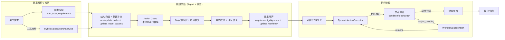
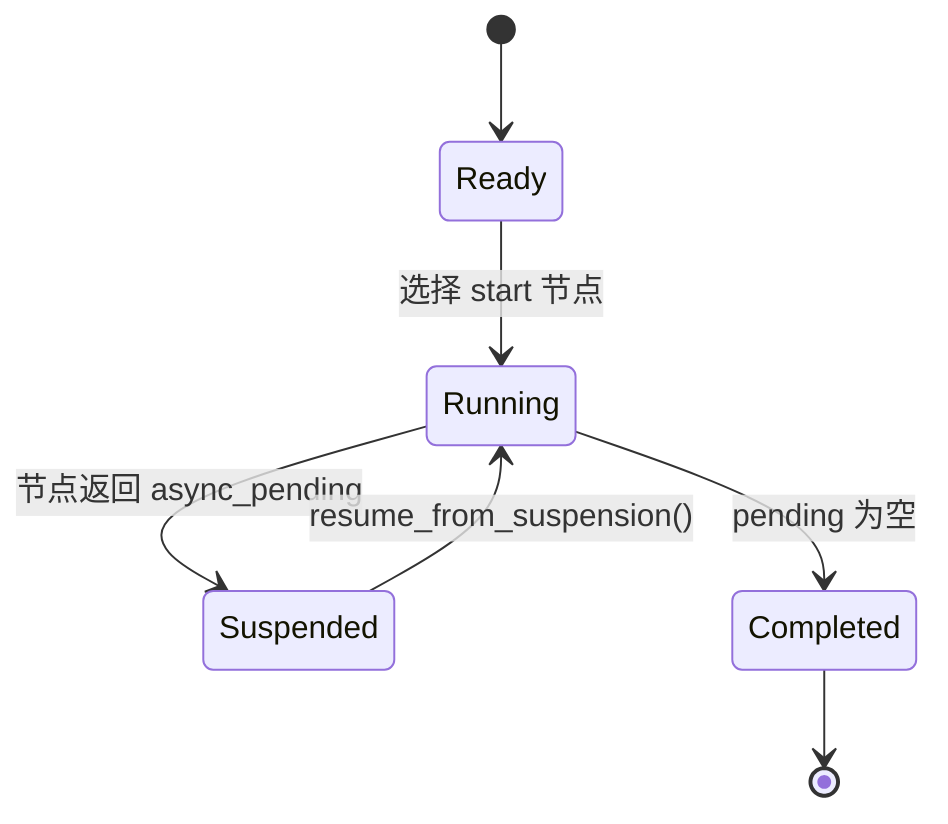
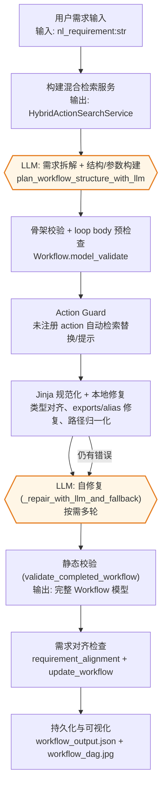

# VelvetFlow [](https://github.com/zhongkaifu/VelvetFlow/actions/workflows/ci.yml)
[](logo.jpg)

VelvetFlow 是一个可复用的 LLM 驱动工作流规划与执行演示项目。项目包含混合检索、Agent 工具驱动的结构 + 参数补全、静态校验与自修复、参数绑定 DSL、可模拟执行器与 DAG 可视化，帮助从自然语言需求自动构建并运行业务流程。近期已将 Planner 全面迁移到 **OpenAI Agent SDK**（`agents.Agent`/`Runner`/`function_tool`），以便在同一套工具描述下同时适配云端 Agent 与本地调试场景。

开篇先交代业务与交付价值：更少人工即可把文字需求变成可执行流程，内置安全审计、防御式修复与回滚路径，缩短 PoC 周期并提高交付确定性。随后的章节概述核心架构（混合检索、需求拆解、结构/参数补全、Action Guard、本地/LLM 修复、需求对齐、可视化与模拟执行器），再逐步下钻到项目结构、运行方式、规划与执行细节及 DSL 参考，既便于决策判断落地性，也方便工程师按步骤复刻实现。

## 文档与导航
- [docs/quickstart.md](docs/quickstart.md)：三分钟完成安装、索引构建与示例运行。
- [docs/core_concepts.md](docs/core_concepts.md)：Workflow/Node/Edge/Binding 的数据模型与引用规则。
- [docs/workflow_dsl_schema.md](docs/workflow_dsl_schema.md)：Workflow DSL 的字段说明、节点类型与完整示例。
- [docs/advanced_guide.md](docs/advanced_guide.md)：检索调优、模型替换、异步节点恢复等进阶玩法。
- [docs/internal_design.md](docs/internal_design.md)：执行引擎与状态机示意、设计模式与模块分层。
- [docs/troubleshooting.md](docs/troubleshooting.md)：常见错误、自查步骤与定位日志。

## 架构总览（执行引擎与状态流转）
下面的引擎示意突出混合检索、规划 + 校验修复与动态执行的衔接：



执行器在运行过程中会经历“就绪 → 运行 → 挂起 → 恢复 → 完成”的闭环，并允许任意数量的异步节点挂起与恢复：



核心状态数据包括已访问节点 `visited`、可达集合 `reachable`、阻断分支 `blocked` 与绑定上下文快照，均封装在 `ExecutionCheckpoint`，以便序列化后恢复。

## 项目结构
```
VelvetFlow (repo root)
├── build_action_index.py        # 离线构建动作检索索引
├── simulation_data.json         # 执行动作的模拟返回模板
├── velvetflow/
│   ├── action_registry.py       # 从 tools/business_actions/ 读取动作，附加安全元数据
│   ├── aggregation.py           # 聚合/过滤操作的通用实现
│   ├── bindings.py              # 参数绑定 DSL 解析/校验
│   ├── reference_utils.py       # 引用路径归一化与替换工具
│   ├── workflow_parser.py       # JSON Workflow 的加载与归一化
│   ├── metrics.py               # RunManager 与指标收集
│   ├── config.py                # 默认 OpenAI 模型配置
│   ├── executor/                # 动态执行器与节点 mixin，支持条件/循环/异步挂起
│   ├── logging_utils.py         # 终端友好日志 & 事件日志
│   ├── loop_dsl.py              # loop 节点 exports 输出 Schema 辅助
│   ├── models.py                # Workflow/Node/Edge 强类型模型与校验
│   ├── planner/                 # 结构规划、补参、更新与自修复，基于 Agent SDK
│   │   ├── agent_runtime.py     # Agent SDK 兼容层，集中导出 Agent/Runner/function_tool
│   │   ├── workflow_builder.py  # 规划期的可变骨架构建器，附带隐式 edges/depends_on
│   │   ├── structure.py         # 结构规划 Agent（需求拆解 + 节点构建 + 参数补全）
│   │   ├── params_tools.py      # 参数补全的工具 Schema（强制 Jinja 参数）
│   │   ├── requirement_alignment.py # 需求对齐检查与缺口补齐
│   │   ├── repair.py            # 自修复 Agent，支持补丁与命名修复工具
│   │   ├── orchestrator.py      # 规划/更新的管线编排与多轮修复
│   │   ├── action_guard.py / approval.py / relations.py / update.py 等辅助模块
│   ├── verification/            # 规划/更新/执行共享的静态校验模块
│   ├── search.py                # 在线检索：基于离线索引的混合排序
│   ├── search_index.py          # 离线索引：关键词与向量索引的构建/持久化
│   ├── workflow_parser.py       # DSL 语法/语义解析与增量校验
│   └── visualization.py         # 将 workflow 渲染为 JPEG DAG
├── tools/
│   ├── business_actions/        # HR/OPS/CRM 等示例动作库（按命名空间拆分）
│   ├── builtin.py               # 通用检索/网页抓取等内置动作
│   └── action_index.json        # 默认的检索索引缓存
├── webapp/                      # FastAPI + Canvas 的可视化/交互式 Planner & Executor
├── build_workflow.py            # 端到端生成 + 可视化示例入口
├── execute_workflow.py          # 从已保存 JSON 执行 workflow
└── LICENSE
```

- **Agent SDK 驱动的 Planner**：结构规划与参数补全在 `planner/structure.py` 内完成，Agent 先通过 `plan_user_requirement` 拆解需求，再使用节点增删改与 `update_node_params` 工具构建骨架并补全 params；`planner/agent_runtime.py` 集中导出 `Agent`/`Runner`/`function_tool`，确保同一套工具协议可在云端 Agent 与本地运行之间切换。
- **业务动作注册表**：`action_registry.py` 从 `tools/business_actions/` 载入动作，自动补齐 `requires_approval` / `allowed_roles` 安全字段，并提供 `get_action_by_id` 查询。
- **离线索引 + 在线混合检索**：`search_index.py` 使用 OpenAI `text-embedding-3-large` 将业务动作构建为关键词与 embedding 索引，可由 `./build_action_index.py` 独立运行生成；`search.py` 读取索引并使用 `FakeElasticsearch`（关键词计分）与基于 Faiss 的向量检索（余弦相似度）混合排序，在线检索阶段仅对 query 进行 OpenAI embedding 再与索引中已有的动作 embedding 做匹配，`HybridActionSearchService` 提供工作流规划阶段的工具召回。
- **工作流规划 Orchestrator**：`planner/orchestrator.py` 实现 `plan_workflow_with_two_pass`，在结构规划完成后依次执行 Action Guard、Jinja 规范化与本地修复、静态校验与 LLM 修复，再通过 `requirement_alignment.py` 检测需求缺口并用 `update_workflow_with_two_pass` 迭代补齐：
  - 结构规划阶段内置需求拆解与节点/参数构建工具，loop body 引用缺失会在进入补全前先做预检查。
  - Action Guard 会对 `action_id` 做白名单校验，支持基于检索的一键替换与 LLM 修复。
  - 本地修复涵盖 Jinja 规范化、类型对齐、`loop.exports` 补全、alias 对齐与绑定路径归一化，之后再由静态校验与多轮 LLM 修复保证可执行性。
  - 需求对齐会分析拆解后的 requirement 与现有 workflow 的映射，若仍有缺口会调用更新管线补齐节点或参数。
- **DSL 模型与校验**：`models.py` 定义 Node/Edge/Workflow 的强类型模型（`model_validate`/`model_dump` 接口与 Pydantic 类似但不依赖其运行时），边由参数绑定与条件分支自动推导并在可视化/执行前归一化；校验涵盖节点类型、隐式连线合法性、loop 子图 Schema 等，并通过 `ValidationError` 统一描述错误。
  - **参数绑定 DSL**：系统现已 **仅支持 Jinja 表达式**（例如 `"{{ result_of.node.field }}"`），其他旧式结构化绑定不再被接收，确保 planner/执行器处理的都是字符串模板。参数校验与类型推断集中在 `bindings.py`/`verification` 目录中完成。
- **执行器**：`executor/` 包中的 `DynamicActionExecutor` 会先校验 action_id 是否在注册表中，再执行拓扑排序确保连通；支持 condition 节点（基于 `params.expression` 的 Jinja 表达式）与 loop 节点（`body_subgraph` + `params.exports` 逐轮收集结果），并结合 repo 根目录的 `simulation_data.json` 模拟动作返回。日志输出使用 `logging_utils.py`。
- **可视化**：`visualization.py` 提供 `render_workflow_dag`，支持 Unicode 字体回退，将 Workflow 渲染为 JPEG DAG。
- **Jinja 表达式支持**：`jinja_utils.py` 构建严格模式的 Jinja 环境并在校验/执行前把包裹在 `{{ }}` 的纯字面量折叠为常量，静态检查会提前阻止语法错误的模板，运行时也可以在条件/聚合里直接求值表达式。【F:velvetflow/jinja_utils.py†L8-L114】【F:velvetflow/verification/jinja_validation.py†L50-L189】【F:velvetflow/executor/conditions.py†L14-L114】

## 业务价值与演进方向
- **投入产出**：将需求解读、动作匹配、参数落地和校验自动化，避免人工对接和回滚，适合快速验证跨 HR/OPS/CRM 等场景的流程自动化可行性。
- **可靠性**：多轮静态校验 + 本地自动修复 + LLM 修复的组合，保证即便模型输出异常仍能返回合法的 Workflow，降低上线风险。【F:velvetflow/planner/orchestrator.py†L361-L940】
- **演进方向**：未来可在 Action Registry 接入实时企业数据源、在检索阶段加入权限/成本信号，或将模拟执行器替换为真实后端服务以验证端到端的产出质量。

## 使用方法
1. **安装依赖（支持 pip 或 uv）**
 - 使用 pip + venv：
   ```bash
   python -m venv .venv
   source .venv/bin/activate
   pip install -r requirements.txt
    # Planner 依赖 OpenAI Agent SDK 的 Agent/Runner/function_tool
    pip install agents
   ```
  - 使用 [uv](https://github.com/astral-sh/uv)（依赖由 `pyproject.toml` 描述，默认创建 `.venv`）：
    ```bash
    uv venv --python 3.10
    source .venv/bin/activate
    uv sync
    uv add agents
    ```
    uv 会自动读取 `pyproject.toml` 同步依赖；后续可以用 `uv run python build_workflow.py` 等方式直接运行脚本。
2. **设置凭证**
   ```bash
   export OPENAI_API_KEY="<your_api_key>"
   ```
3. **离线构建工具集索引（可选）**
   - 若需根据最新的 `tools/business_actions/` 重建关键词与向量索引，可运行：
     ```bash
     python build_action_index.py --output tools/action_index.json --model text-embedding-3-large
     ```
   - 该脚本会调用 OpenAI embedding 生成 `tools/action_index.json`，供在线阶段的混合检索（FakeElasticsearch + Faiss 向量检索）读取。
4. **运行端到端示例**
   ```bash
   python build_workflow.py
   ```
   - 按提示输入自然语言需求（或直接回车使用默认示例），程序将构建混合检索服务、规划/校验工作流，并打印最终 DSL。
   - 结果会持久化到 `workflow_output.json`，并生成 `workflow_dag.jpg`。
5. **从已保存 JSON 执行工作流**
   ```bash
   python execute_workflow.py --workflow-json workflow_output.json
   ```
   - 执行器会解析绑定 DSL、运行条件/循环节点，并使用 `simulation_data.json` 生成模拟结果。
6. **从 JSON 绘制工作流 DAG**
   ```bash
   python render_workflow_image.py --workflow-json workflow_output.json --output workflow_dag.jpg
   ```
   - 读取已有的 workflow JSON，将 DAG 渲染成 JPEG。对于 action 节点，会额外显示调用的工具名称和输入参数。
7. **校验任意 workflow JSON（可选）**
   ```bash
   python validate_workflow.py path/to/workflow.json --action-registry tools/business_actions --print-normalized
   ```
   - 复用语法/语义解析、`Workflow.model_validate` 与静态规则输出详细错误；`--print-normalized` 可打印归一化后的 DSL。
8. **在现有 workflow 上迭代需求（可选）**
   ```bash
   python update_workflow.py path/to/workflow.json --requirement "新增审批环节" --output workflow_updated.json
   ```
   - 将自然语言需求与现有 workflow 作为输入，调用 LLM 自动更新节点、参数与边；若校验失败会将错误列表反馈给 LLM 自动修复（最多 3 轮），最终写入通过校验的结果到 `--output` 指定的文件。

### Web 可视化界面（带 Planner/Executor 的实时交互）
- `webapp/` 目录提供了基于 Canvas 的前端页面，默认包含可缩放/拖拽的 DAG 画布、JSON 编辑器双 Tab，以及“添加节点/保存/加载”对话框，方便直接在浏览器调整 workflow。`core.js` 里内置节点生成、画布缩放/拖拽、多 Tab 独立布局等逻辑。【F:webapp/js/core.js†L1-L157】【F:webapp/js/core.js†L191-L329】【F:webapp/js/dialogs.js†L1-L148】
- 后端使用 FastAPI 暴露 `/api/plan`、`/api/run` 以及对应的 `/stream` SSE 端点，能在计划/执行时实时推送日志与渐进式节点快照；`/api/actions` 则返回动作清单供前端下拉选择。【F:webapp/server.py†L52-L120】【F:webapp/server.py†L214-L365】
- **请使用 `python webapp/server.py` 直接启动内置 API 服务**（不要用 `python -m http.server` 之类的纯静态服务器，否则 `/api/plan`/`/api/run` 会返回 `Unsupported method ('POST')`）：
  ```bash
  export OPENAI_API_KEY="<your_api_key>"
  pip install -r requirements.txt
  python webapp/server.py
  ```
  然后访问 <http://localhost:8000> 即可。对话框会把自然语言发送到 `/api/plan` 或 `/api/plan/stream`，由 planner 自动构建/修复 workflow 并返回拓扑，Run 按钮会调用 `/api/run` 或 `/api/run/stream` 触发执行并输出运行日志/结果。

## 异步工具调用、挂起与恢复
- **触发异步**：在 action/loop 子图节点的 `params` 中加入 `"__invoke_mode": "async"`（或布尔 `"__async__": true`）即可请求异步调用。业务工具若直接返回 `AsyncToolHandle` 会被识别为异步；否则执行器会自动将同步输出包装为异步请求句柄。异步调用会写入 `GLOBAL_ASYNC_RESULT_STORE`，并返回 `{"status": "async_pending", ...}`。
- **挂起前的快照**：遇到异步节点时，执行器会生成 `WorkflowSuspension`，其中包含：当前节点 `request_id`/`node_id`、完整 `workflow_dict`、以及 `BindingContext` 的快照（含节点结果、循环索引、loop 导出等）。该对象可调用 `save_to_file(path)` 将快照持久化到 JSON 文件。
- **恢复机制**：外部服务完成后，可将工具结果写入 JSON 文件，通过 `WorkflowSuspension.load_from_file()` 加载挂起文件，再调用 `DynamicActionExecutor.resume_from_suspension(suspension, tool_result=...)` 继续执行。若使用 CLI，可直接指定 `--resume-from` 与 `--tool-result-file`，执行器会自动恢复上下文并推动后续节点。
- **演示示例**：仓库提供了完整的 CLI 演示数据：
  ```bash
  # 首次运行：异步节点挂起，并将 suspension 写入 examples/async_suspend_resume/suspension.json
  python execute_workflow.py \
    --workflow-json examples/async_suspend_resume/workflow_async_health.json \
    --suspension-file examples/async_suspend_resume/suspension.json

  # 外部工具完成后，将结果写入示例文件（可直接复用仓库内的 tool_result_completed.json）并恢复执行
  python execute_workflow.py \
    --workflow-json examples/async_suspend_resume/workflow_async_health.json \
    --resume-from examples/async_suspend_resume/suspension.json \
    --tool-result-file examples/async_suspend_resume/tool_result_completed.json
  ```
  - `workflow_async_health.json` 展示了带 `__invoke_mode: "async"` 的节点及其下游引用。
  - `tool_result_completed.json` 模拟异步工具的完成回调，恢复后可查看下游节点如何消费该结果。
  - 如需自定义模拟输出，可通过 `--simulation-file` 指向自定义的模拟数据。

## 工作流构建流程（含 LLM 标注）
下面将端到端流程拆解为可复用的流水线，体现近期新增的“防御式校验 + 自动修复”改动：

1. **需求接收与环境准备**：获取自然语言需求，加载业务动作库并初始化混合检索服务，后续 Action Guard 将复用检索结果做自动替换。
2. **需求拆解 + 结构/参数构建（Agent）**：`plan_workflow_structure_with_llm` 内联工具先调用 `plan_user_requirement` 拆解需求，再用节点增删改与 `update_node_params` 构建骨架并补全 params（全部以 Jinja 表达式为主），边由绑定与分支指向自动推导。【F:velvetflow/planner/structure.py†L373-L1188】
3. **初步校验与 Action Guard**：结构结果会先做 loop body 预检查并执行 `Workflow.model_validate`，随后进入 Action Guard；未注册/缺失的 `action_id` 会先尝试用混合检索一键替换，再将剩余问题交给 LLM 修复，确保进入后续校验阶段的动作都在白名单内。【F:velvetflow/planner/orchestrator.py†L104-L343】
4. **Jinja 规范化与本地修复**：进入多轮本地修复，包括 Jinja 语法规范化、类型对齐、`loop.exports` 补全、alias 对齐与绑定路径归一化： 
   - **条件/引用类型矫正**：根据 condition kind 需求与输出 Schema 自动转换数值/正则类型，并为绑定引用与目标 Schema 之间的类型不匹配提供自动包装或错误提示。【F:velvetflow/planner/orchestrator.py†L444-L580】
   - **loop.exports 补全**：自动填充缺失的 `params.exports` 映射并规范化导出字段，避免循环节点留空导致 LLM 返工。【F:velvetflow/planner/orchestrator.py†L589-L662】
   - **Schema 感知修复**：移除动作 Schema 未定义的字段、为空字段写入默认值或尝试按类型转换，再进入正式校验；无法修复的错误会打包为 `ValidationError` 供后续 LLM 使用。【F:velvetflow/planner/repair_tools.py†L63-L215】【F:velvetflow/planner/orchestrator.py†L664-L817】
5. **静态校验 + LLM 自修复循环**：`validate_completed_workflow` 会在每轮本地修复后运行，若仍有错误则将错误分布与上下文交给 `_repair_with_llm_and_fallback`，在限定轮次内迭代直至通过或返回最后一个合法版本。【F:velvetflow/planner/orchestrator.py†L664-L940】
6. **需求对齐补全**：规划器会调用 `requirement_alignment.py` 对照需求拆解结果，若仍有缺口则触发 `update_workflow_with_two_pass` 继续补齐节点或参数，再次走相同的校验/修复链路。【F:velvetflow/planner/orchestrator.py†L1460-L1494】【F:velvetflow/planner/requirement_alignment.py†L18-L80】
7. **持久化与可视化**：通过校验后写出 `workflow_output.json`，并可用 `render_workflow_image.py` 生成 `workflow_dag.jpg`，同时日志保留所有 LLM 对话与自动修复记录便于审计。

下方流程图将关键输入/输出、自动修复节点与 LLM 交互标出：



LLM / Agent SDK 相关节点说明：
- **结构规划 Agent**：基于自然语言需求先调用 `plan_user_requirement` 拆解任务，再通过节点增删改与 `update_node_params` 工具补全 params（Jinja 表达式为主）。`WorkflowBuilder` 会把推导出的 edges、condition 分支与 `depends_on` 写回骨架，方便下游校验共享上下文；节点字段也会按节点类型或 action schema 过滤无关字段，避免 Agent 生成不可识别的参数。【F:velvetflow/planner/structure.py†L373-L1188】【F:velvetflow/planner/workflow_builder.py†L20-L222】
- **动作合法性守卫**：若发现 `action_id` 缺失或未注册，会先尝试基于 display_name/原 action_id 检索替换，再将剩余问题交给 LLM 修复，避免幻觉动作进入最终 Workflow。【F:velvetflow/planner/orchestrator.py†L104-L343】
- **Jinja 规范化与参数一致性**：规划/校验阶段会将简单路径转换为 Jinja 字符串，并对非模板参数给出修复建议；参数补全阶段的 schema 约束来自 `params_tools.py`，确保节点 params 与动作 arg_schema 对齐。【F:velvetflow/planner/params_tools.py†L1-L193】【F:velvetflow/verification/jinja_validation.py†L10-L189】
- **需求对齐检查**：对照拆解后的 requirements，检测 workflow 是否缺失关键步骤；如有缺口，触发 `update_workflow_with_two_pass` 继续补齐，并复用相同的校验/修复管线。【F:velvetflow/planner/orchestrator.py†L1460-L1494】【F:velvetflow/planner/requirement_alignment.py†L18-L80】
- **自修复 Agent**：当静态校验或本地修复仍未通过时，使用当前 workflow 字典与 `ValidationError` 列表提示模型修复。Agent 可以调用命名修复工具（如替换引用、补必填参数、规范化绑定路径）或提交补丁文本，直至通过或达到 `max_repair_rounds`，并在过程中保留最近一次合法版本以确保可回退。【F:velvetflow/planner/repair.py†L616-L756】【F:velvetflow/planner/orchestrator.py†L664-L940】

### Agent 工具的设计与运行方式
- **会话级工具与闭包状态**：结构规划的工具集（需求拆解、检索、设置 meta、节点增删改、参数补全）在 `plan_workflow_structure_with_llm` 内使用 `@function_tool(strict_mode=False)` 声明，并依托闭包保存 `WorkflowBuilder`、动作候选与检索结果等上下文，`planner/agent_runtime.py` 统一导出 `Agent`/`Runner`/`function_tool` 便于切换 Agent SDK 版本。【F:velvetflow/planner/structure.py†L373-L1836】【F:velvetflow/planner/agent_runtime.py†L4-L26】
- **系统提示词与回合驱动**：结构规划 Agent 在构造 system prompt 时明确“先拆解需求、禁止幻觉动作、loop 引用范围限制”，随后通过 `Runner.run_sync(..., max_turns)` 触发多轮工具调用，必要时自动回落到异步 `Runner.run`；修复 Agent 复用同一 Runner 调用方式，实现统一的日志与会话管理。【F:velvetflow/planner/structure.py†L560-L596】【F:velvetflow/planner/structure.py†L1134-L1163】【F:velvetflow/planner/repair.py†L695-L726】
- **工具执行与防御式校验**：动作检索工具会更新候选集并校验后续 `add_action_node` 的合法 action_id，节点的 params/字段会在写入前按节点类型或 action schema 自动裁剪，避免 Agent 输出不受支持的字段；结构完成后会附带推导出的 edges/depends_on 供后续校验与可视化使用。【F:velvetflow/planner/structure.py†L603-L1836】【F:velvetflow/planner/workflow_builder.py†L20-L222】
- **日志与可复现性**：每次工具调用的参数、错误与校验反馈都会写入事件日志，Agent 返回的 messages 也会完整保留，便于重放或定位失败阶段。【F:velvetflow/planner/structure.py†L470-L497】【F:velvetflow/planner/structure.py†L603-L1163】

## 循环节点的处理细节
为方便开发者定位循环相关逻辑，补充 loop 的运行与导出细节：

- **定义与校验**：`models.py` 会检查 loop 的 `source` 路径、`body_subgraph` 的拓扑完整性，以及 `params.exports` 是否为合法的 Jinja 表达式映射，未通过会在规划阶段直接报错，避免运行时才失败。【F:velvetflow/models.py†L70-L92】
- **DSL 辅助 Schema**：`loop_dsl.py` 会根据 `params.exports` 构造 loop 节点的虚拟输出 schema，确保外部只能通过 `result_of.<loop_id>.exports.<key>` 读取循环输出。【F:velvetflow/loop_dsl.py†L1-L96】
- **执行阶段**：`executor.DynamicActionExecutor` 在遇到 loop 节点时会展开 `source` 集合，依次执行 `body_subgraph`，将每轮输出写入 `loop` 上下文。子图可以引用 `loop.item`/`loop.index`/`loop.size`/`loop.accumulator` 或自定义 `item_alias`，并在循环结束后依据 `params.exports` 汇总到上层节点上下文。【F:velvetflow/executor/loops.py†L33-L248】【F:velvetflow/bindings.py†L206-L341】

## 自定义与扩展
- **扩展动作库**：在 `tools/business_actions/` 下增加/调整动作文件，`action_registry.py` 会自动加载并附加安全字段。
- **调优检索**：在 `build_workflow.py` 的 `build_default_search_service` 调整 `alpha` 或替换 `DEFAULT_EMBEDDING_MODEL`/`embed_text_openai` 以适配自定义向量模型。
- **更换模型**：`velvetflow/config.py` 中的 `OPENAI_MODEL` 控制规划/补参阶段使用的 OpenAI Chat 模型。
- **定制执行行为**：修改根目录的 `simulation_data.json` 模板以覆盖动作返回；如需调整条件/循环聚合规则，可在 `velvetflow/executor/conditions.py`、`velvetflow/executor/loops.py` 与 `velvetflow/bindings.py` 中扩展。

## Workflow DSL 速查
下面的 JSON 结构是 VelvetFlow 规划/执行都遵循的 DSL。理解这些字段有助于手写、调试或修复 LLM 产出的 workflow。

### 顶层结构
```jsonc
{
  "workflow_name": "可选: 业务流程名称",
  "description": "可选: 描述",
  "nodes": [ /* 节点数组，详见下文 */ ]
}
```
- 节点会经由 `Workflow.model_validate` 强类型校验（接口与 Pydantic 类似），重复的 `id` 或非法字段都会报错。显式 `edges` 不是必填项：Planner 会基于参数绑定与条件/分支自动推导并在输出中附带只读 edges，执行阶段同样会重新推导拓扑。【F:velvetflow/models.py†L44-L92】【F:velvetflow/models.py†L137-L246】【F:velvetflow/models.py†L441-L468】【F:velvetflow/planner/workflow_builder.py†L179-L222】

### 节点定义（nodes）
每个节点都包含以下字段：

```jsonc
{
  "id": "唯一字符串",
  "type": "start|end|action|condition|switch|loop|parallel",
  "action_id": "仅 action 节点需要，对应 tools/business_actions/ 中的 id",
  "display_name": "可选: 用于可视化/日志的友好名称",
  "params": { /* 取决于节点类型的参数，下文详述 */ }
}
```

- **start/end**：只需 `id` 与 `type`，`params` 可为空。常作为入口/出口。
- **action**：`action_id` 必填；`params` 按动作的 `arg_schema` 填写，支持绑定 DSL（见下文）。
- **condition**：`params.expression` 为布尔 Jinja 表达式，并需要通过 `true_to_node`/`false_to_node` 显式指向下游节点（或设置为 `null` 表示分支终止）。
- **switch**：支持多分支匹配，`params` 中可携带 `source/field` 并在 `cases` 指定 `value` 与 `to_node` 的映射，未命中时走 `default_to_node`。
- **loop**：`params` 需要 `loop_kind`（`for_each`/`while`）、`source`（循环目标，如 `result_of.fetch.items`）、`item_alias`（循环体内引用当前元素）、`body_subgraph`（子图，结构同顶层 workflow）、`exports`（Jinja 表达式映射，逐轮收集）。`body_subgraph` 在解析时也会按完整 Workflow 校验，字段不合法会提前报错。【F:velvetflow/models.py†L70-L92】
- **parallel**：用于前端分组/展示的占位节点（`params.branches` 仅供 UI），执行器目前不会并发调度该分支；实际执行仍依赖普通节点与 `depends_on`/绑定推导的拓扑关系。

### 拓扑推导（隐式 edges）
- 工作流不再需要显式声明 `edges`。执行前会依据参数绑定里的 `result_of.<node>` 引用、字符串中的嵌入引用、condition 节点的 `true_to_node`/`false_to_node`、switch 节点的 `cases/default_to_node` 自动推导有向边，避免重复维护拓扑。
- 推导逻辑会去重并忽略自引用，所有自动生成的边都会在可视化与执行阶段生效。【F:velvetflow/models.py†L137-L246】【F:velvetflow/models.py†L441-L468】

### 参数绑定 DSL（params 内的占位符）
执行器只接受 **Jinja 模板** 形式的绑定（例如 `"{{ result_of.node.field }}"`）。常用能力：
- 直接字符串路径：`"params": {"threshold": "loop.index"}` 这类纯字符串会在规划阶段自动包裹为 Jinja 模板（`{{ loop.index }}`）；解析失败会保留原值并在日志给出警告。
- 绑定路径的有效性：引用动作输出时会根据动作的 `output_schema`/`arg_schema` 或 loop 的 `exports` 做静态校验，字段不存在会在执行前抛错，方便手动调试。【F:velvetflow/bindings.py†L18-L205】【F:velvetflow/bindings.py†L206-L341】
- **Jinja 表达式与常量折叠**：
  - 参数、条件及聚合中的字符串可以写成 Jinja 表达式（如 `"{{ get('result_of.node.score') > 80 }}"`），校验阶段会先用严格模式 Jinja 解析语法并提示错误路径。
  - 对于 `"{{ 'action' }}"` 这类包裹字面量的模板，会在模型校验前折叠成普通字符串，避免字段类型被模板包裹后误判。【F:velvetflow/jinja_utils.py†L8-L114】【F:velvetflow/verification/jinja_validation.py†L50-L189】
  - 执行器解析 condition 或绑定聚合时，会在运行时填充上下文后求值，并复用相同的语法校验逻辑，异常会带上参数路径便于追踪。【F:velvetflow/executor/conditions.py†L14-L208】【F:velvetflow/bindings.py†L334-L532】

### 手动调试与排错建议
1. **先跑校验**：使用 `python validate_workflow.py your_workflow.json --print-normalized`，可以立刻发现重复节点、边引用不存在、loop 子图 schema 不合法等问题。【F:validate_workflow.py†L1-L58】
2. **检查绑定路径**：如果 Jinja 引用报错，确认 `result_of.<node>.<field>` 中的节点是否存在且有对应字段；loop 节点需检查 `exports` 中是否声明了该字段。

### 常见绑定警告示例
- **引用了 loop 未导出的字段**：loop 节点的输出仅包含 `params.exports` 声明的字段，不会直接暴露子图节点的字段。引用 loop 内部节点字段会触发校验错误，应改为引用 loop 导出的数组（如 `result_of.loop_each_news.exports.summary`）。
3. **最小化修改面**：调试时优先修改 `params` 中的绑定表达式或 condition 节点的跳转（`true_to_node`/`false_to_node`），避免破坏整体拓扑。
4. **模拟执行观察输出**：用 `python execute_workflow.py --workflow-json your_workflow.json`，日志会标明每个节点解析后的参数值，便于确认聚合逻辑是否符合预期。
5. **可视化辅助**：通过 `python render_workflow_image.py --workflow-json your_workflow.json --output tmp.jpg` 生成 DAG，快速核对节点/边连通性与显示名称。

## 示例与 Demo
下面的资源可以帮助快速理解 VelvetFlow 的输入、输出与运行效果：

- **交互式 GIF**
  - [](examples/demo_health_check.gif)：展示以“系统健康检查”为需求的端到端流程，从需求输入、规划到 DAG 渲染的实时画面。
  - [](examples/demo_find_top_stock_mover.gif)：展示检索热点股票并生成总结的流程，包含检索/补参/校验的完整记录。
  - [](examples/demo_velvetflow_canvas.gif)：展示 VelvetFlow Canvas 的实时交互画面。

- **可下载的工作流产物**
  - `examples/health_check/`：包含 `workflow_output.json`（可直接用 `execute_workflow.py` 复现）与 `workflow_dag.jpg`（渲染后的拓扑图）。
  - `examples/search_news_summarize/`：同样提供 JSON 与 DAG 图片，演示新闻检索与摘要的工作流。

- **一键复现命令**
  ```bash
  # 复现示例 1：系统健康检查
  python execute_workflow.py --workflow-json examples/health_check/workflow_output.json

  # 复现示例 2：新闻检索 + 摘要
  python execute_workflow.py --workflow-json examples/search_news_summarize/workflow_output.json
  ```
  执行过程中终端日志会打印每个节点解析后的参数、条件判断结果与模拟返回；你也可以结合 `render_workflow_image.py` 重绘 DAG，或将示例 JSON 作为起点用 `update_workflow.py` 迭代新需求。

## 测试（可选）
- 仅进行语法检查可运行：
  ```bash
  python -m compileall velvetflow
  ```
