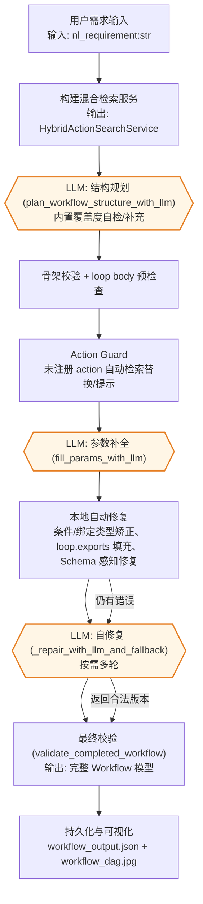

# VelvetFlow [](https://github.com/zhongkaifu/VelvetFlow/actions/workflows/ci.yml)
[](logo.jpg)

VelvetFlow 是一个可复用的 LLM 驱动工作流规划与执行演示项目。项目包含混合检索、两阶段 LLM 规划（结构 + 补参）、静态校验与自修复、参数绑定 DSL、可模拟执行器与 DAG 可视化，帮助从自然语言需求自动构建并运行业务流程。

开篇先交代业务与交付价值：更少人工即可把文字需求变成可执行流程，内置安全审计、防御式修复与回滚路径，缩短 PoC 周期并提高交付确定性。随后的章节概述核心架构（混合检索、两阶段规划、Action Guard、本地/LLM 修复、可视化与模拟执行器），再逐步下钻到项目结构、运行方式、规划与执行细节及 DSL 参考，既便于决策判断落地性，也方便工程师按步骤复刻实现。

## 项目结构
```
VelvetFlow (repo root)
├── build_action_index.py        # 离线构建动作检索索引
├── simulation_data.json         # 执行动作的模拟返回模板
├── velvetflow/
│   ├── action_registry.py       # 从 tools/business_actions/ 读取动作，附加安全元数据
│   ├── bindings.py              # 参数绑定 DSL 解析/校验
│   ├── config.py                # 默认 OpenAI 模型配置
│   ├── executor.py              # 动态执行器，支持条件/循环/聚合导出
│   ├── logging_utils.py         # 终端友好日志 & 事件日志
│   ├── loop_dsl.py              # loop 节点 exports 输出 Schema 辅助
│   ├── models.py                # Workflow/Node/Edge 强类型模型与校验
│   ├── planner/                 # 结构规划、补参与自修复模块
│   ├── verification/            # 规划/更新/执行共享的静态校验模块
│   ├── search.py                # 在线检索：基于离线索引的混合排序
│   ├── search_index.py          # 离线索引：关键词与向量索引的构建/持久化
│   └── visualization.py         # 将 workflow 渲染为 JPEG DAG
├── tools/
│   ├── business_actions/        # HR/OPS/CRM 等示例动作库（按命名空间拆分）
│   └── ...
├── build_workflow.py                  # 端到端生成 + 可视化示例入口
├── execute_workflow.py                 # 从已保存 JSON 执行 workflow
└── LICENSE
```

## 核心能力
- **业务动作注册表**：`action_registry.py` 从 `tools/business_actions/` 载入动作，自动补齐 `requires_approval` / `allowed_roles` 安全字段，并提供 `get_action_by_id` 查询。
- **离线索引 + 在线混合检索**：`search_index.py` 使用 OpenAI `text-embedding-3-large` 将业务动作构建为关键词与 embedding 索引，可由 `./build_action_index.py` 独立运行生成；`search.py` 读取索引并使用 `FakeElasticsearch`（关键词计分）与基于 Faiss 的向量检索（余弦相似度）混合排序，在线检索阶段仅对 query 进行 OpenAI embedding 再与索引中已有的动作 embedding 做匹配，`HybridActionSearchService` 提供工作流规划阶段的工具召回。
- **工作流规划 Orchestrator**：`planner/orchestrator.py` 实现两阶段 `plan_workflow_with_two_pass`，在结构规划 + 补参后还会自动做动作合法性守卫、字段类型比对、缺省导出填充，再进入 LLM 修复循环：
  - 结构规划通过覆盖度检查、自动补齐条件分支跳转/修补循环 exports、审批节点检查等提升连通性与完备性，同时提前验证 loop body 的节点引用是否存在。
  - 补参阶段后增加“Action Guard”，若发现未注册或缺失的 `action_id` 会先尝试用混合检索一键替换，失败再引导 LLM 修复；并在条件/引用绑定上自动做类型矫正或生成可操作的错误提示。
  - 本地自动修复（缺字段默认值、移除 schema 未定义字段、匹配输出/输入的类型转换、填充 `loop.exports`）完成后，再由 `verification/validation.py` 做最终静态校验并按需多轮 LLM 修复。
- **DSL 模型与校验**：`models.py` 定义 Node/Edge/Workflow，边由参数绑定与条件分支自动推导并在可视化/执行前归一化；校验涵盖节点类型、隐式连线合法性、loop 子图 Schema 等，并通过 `ValidationError` 统一描述错误。
- **参数绑定 DSL**：`bindings.py` 支持 `__from__` 引用上游结果，`__agg__` 支持 `identity/count/count_if/format_join/filter_map/pipeline`，并校验引用路径是否存在于动作输出/输入或 loop exports。
- **执行器**：`executor.py` 的 `DynamicActionExecutor` 会先校验 action_id 是否在注册表中，再执行拓扑排序确保连通；支持 condition 节点（如 list_not_empty/equals/contains/greater_than/between 等）与 loop 节点（body_subgraph + exports.items/aggregates 收集迭代与聚合结果），并结合 repo 根目录的 `simulation_data.json` 模拟动作返回。日志输出使用 `logging_utils.py`。
- **可视化**：`visualization.py` 提供 `render_workflow_dag`，支持 Unicode 字体回退，将 Workflow 渲染为 JPEG DAG。

## 业务价值与演进方向
- **投入产出**：将需求解读、动作匹配、参数落地和校验自动化，避免人工对接和回滚，适合快速验证跨 HR/OPS/CRM 等场景的流程自动化可行性。
- **可靠性**：多轮静态校验 + 本地自动修复 + LLM 修复的组合，保证即便模型输出异常仍能返回合法的 Workflow，降低上线风险。【F:velvetflow/planner/orchestrator.py†L361-L940】
- **演进方向**：未来可在 Action Registry 接入实时企业数据源、在检索阶段加入权限/成本信号，或将模拟执行器替换为真实后端服务以验证端到端的产出质量。

## 使用方法
1. **安装依赖**
   ```bash
   python -m venv .venv
   source .venv/bin/activate
   pip install --upgrade openai numpy pillow pydantic
   ```
2. **设置凭证**
   ```bash
   export OPENAI_API_KEY="<your_api_key>"
   ```
3. **离线构建工具集索引（可选）**
   - 若需根据最新的 `tools/business_actions/` 重建关键词与向量索引，可运行：
     ```bash
     python build_action_index.py --output tools/action_index.json --model text-embedding-3-large
     ```
   - 该脚本会调用 OpenAI embedding 生成 `tools/action_index.json`，供在线阶段的混合检索（FakeElasticsearch + Faiss 向量检索）读取。
4. **运行端到端示例**
   ```bash
   python build_workflow.py
   ```
   - 按提示输入自然语言需求（或直接回车使用默认示例），程序将构建混合检索服务、两阶段规划工作流，并打印最终 DSL。
   - 结果会持久化到 `workflow_output.json`，并生成 `workflow_dag.jpg`。
5. **从已保存 JSON 执行工作流**
   ```bash
   python execute_workflow.py --workflow-json workflow_output.json
   ```
   - 执行器会解析绑定 DSL、运行条件/循环节点，并使用 `simulation_data.json` 生成模拟结果。
6. **从 JSON 绘制工作流 DAG**
   ```bash
   python render_workflow_image.py --workflow-json workflow_output.json --output workflow_dag.jpg
   ```
   - 读取已有的 workflow JSON，将 DAG 渲染成 JPEG。对于 action 节点，会额外显示调用的工具名称和输入参数。
7. **校验任意 workflow JSON（可选）**
   ```bash
   python validate_workflow.py path/to/workflow.json --action-registry tools/business_actions --print-normalized
   ```
   - 复用规划阶段的静态规则与 Pydantic 校验，输出详细错误；`--print-normalized` 可打印归一化后的 DSL。
8. **在现有 workflow 上迭代需求（可选）**
   ```bash
   python update_workflow.py path/to/workflow.json --requirement "新增审批环节" --output workflow_updated.json
   ```
   - 将自然语言需求与现有 workflow 作为输入，调用 LLM 自动更新节点、参数与边；若校验失败会将错误列表反馈给 LLM 自动修复（最多 3 轮），最终写入通过校验的结果到 `--output` 指定的文件。

### Web 可视化界面（无需后端即可体验）
- `webapp/` 目录提供了基于 Canvas 的前端页面，包含 VelvetFlow Agent 对话框、DAG/流程图双 Tab 视图、可编辑的 workflow JSON 与一键 Run 模拟执行按钮。
- 在仓库根目录运行静态服务即可体验：
  ```bash
  python -m http.server 8000 --directory webapp
  ```
  然后访问 <http://localhost:8000> 即可。通过输入自然语言可触发示例 DAG 构建、查看日志并手动编辑节点/连线。

## 异步工具调用、挂起与恢复
- **触发异步**：在 action/loop 子图节点的 `params` 中加入 `"__invoke_mode": "async"`（或布尔 `"__async__": true`）即可请求异步调用。业务工具若直接返回 `AsyncToolHandle` 会被识别为异步；否则执行器会自动将同步输出包装为异步请求句柄。异步调用会写入 `GLOBAL_ASYNC_RESULT_STORE`，并返回 `{"status": "async_pending", ...}`。
- **挂起前的快照**：遇到异步节点时，执行器会生成 `WorkflowSuspension`，其中包含：当前节点 `request_id`/`node_id`、完整 `workflow_dict`、以及 `BindingContext` 的快照（含节点结果、循环索引、loop 导出等）。该对象可调用 `save_to_file(path)` 将快照持久化到 JSON 文件。
- **恢复机制**：外部服务完成后，可将工具结果写入 JSON 文件，通过 `WorkflowSuspension.load_from_file()` 加载挂起文件，再调用 `DynamicActionExecutor.resume_from_suspension(suspension, tool_result=...)` 继续执行。若使用 CLI，可直接指定 `--resume-from` 与 `--tool-result-file`，执行器会自动恢复上下文并推动后续节点。
- **演示示例**：仓库提供了完整的 CLI 演示数据：
  ```bash
  # 首次运行：异步节点挂起，并将 suspension 写入 examples/async_suspend_resume/suspension.json
  python execute_workflow.py \
    --workflow-json examples/async_suspend_resume/workflow_async_health.json \
    --suspension-file examples/async_suspend_resume/suspension.json

  # 外部工具完成后，将结果写入示例文件（可直接复用仓库内的 tool_result_completed.json）并恢复执行
  python execute_workflow.py \
    --workflow-json examples/async_suspend_resume/workflow_async_health.json \
    --resume-from examples/async_suspend_resume/suspension.json \
    --tool-result-file examples/async_suspend_resume/tool_result_completed.json
  ```
  - `workflow_async_health.json` 展示了带 `__invoke_mode: "async"` 的节点及其下游引用。
  - `tool_result_completed.json` 模拟异步工具的完成回调，恢复后可查看下游节点如何消费该结果。
  - 如需自定义模拟输出，可通过 `--simulation-file` 指向自定义的模拟数据。

## 工作流构建流程（含 LLM 标注）
下面将端到端流程拆解为可复用的流水线，体现近期新增的“防御式校验 + 自动修复”改动：

1. **需求接收与环境准备**：获取自然语言需求，加载业务动作库并初始化混合检索服务，后续 Action Guard 将复用检索结果做自动替换。
2. **结构规划 + 覆盖度校验（LLM）**：`plan_workflow_structure_with_llm` 通过 `planner/tools.py` 工具集多轮构建 `nodes/entry/exit` 骨架（无需显式 edges，拓扑由参数引用与条件分支推导），每次 `finalize_workflow` 都会触发覆盖度检查并将缺失点回注给 LLM；同时提前检查 loop body 中的节点引用是否缺失，必要时进入修复。【F:velvetflow/planner/structure.py†L631-L960】【F:velvetflow/planner/tools.py†L1-L192】【F:velvetflow/planner/coverage.py†L13-L118】【F:velvetflow/planner/orchestrator.py†L170-L236】
3. **动作守卫与骨架校准**：结构结果会被 Pydantic 校验并进入 Action Guard。未注册/缺失的 `action_id` 会先尝试用混合检索一键替换，再将剩余问题交给 LLM 修复，确保进入补参阶段的动作都在白名单内。【F:velvetflow/planner/orchestrator.py†L104-L214】【F:velvetflow/planner/orchestrator.py†L262-L343】
4. **参数补全（LLM）**：`fill_params_with_llm` 在骨架上补齐各节点的 `params`、`exports` 与绑定表达式。若补参异常会直接回滚到上次合法版本，并走同样的 Action Guard 保障动作合法性。【F:velvetflow/planner/orchestrator.py†L361-L432】
5. **本地自动修复与类型对齐**：补参结果会先经过多轮本地修复：
   - **条件/引用类型矫正**：根据 condition kind 需求与输出 Schema 自动转换数值/正则类型，并为绑定的 `__from__` 与目标 Schema 之间的类型不匹配提供自动包装或错误提示。【F:velvetflow/planner/orchestrator.py†L444-L580】
   - **loop.exports 补全**：自动填充缺失的 `items/aggregates` 声明并规范化导出字段，避免循环节点留空导致 LLM 返工。【F:velvetflow/planner/orchestrator.py†L589-L662】
   - **Schema 感知修复**：移除动作 Schema 未定义的字段、为空字段写入默认值或尝试按类型转换，再进入正式校验；无法修复的错误会打包为 `ValidationError` 供后续 LLM 使用。【F:velvetflow/planner/repair_tools.py†L63-L215】【F:velvetflow/planner/orchestrator.py†L664-L817】
6. **静态校验 + LLM 自修复循环**：`validate_completed_workflow` 会在每轮本地修复后运行，若仍有错误则将错误分布与上下文交给 `_repair_with_llm_and_fallback`，在限定轮次内迭代直至通过或返回最后一个合法版本。【F:velvetflow/planner/orchestrator.py†L671-L817】【F:velvetflow/planner/orchestrator.py†L834-L940】
7. **持久化与可视化**：通过校验后写出 `workflow_output.json`，并可用 `render_workflow_image.py` 生成 `workflow_dag.jpg`，同时日志保留所有 LLM 对话与自动修复记录便于审计。

下方流程图将关键输入/输出、自动修复节点与 LLM 交互标出：



LLM 相关节点说明：
- **结构规划**：基于自然语言需求与动作 schema，生成 `nodes/entry/exit` 的骨架，连线关系由参数绑定与 condition 的 true/false 跳转隐式推导。规划阶段会使用预置的工具集（添加节点、设置入口出口、修改 meta 信息等），模型通过 tool-calling 自动选择，所有调用结果会以日志形式保存，便于复现或对照失败案例。【F:velvetflow/planner/structure.py†L337-L451】【F:velvetflow/models.py†L137-L246】【F:velvetflow/models.py†L441-L468】
- **覆盖度检查**：在结构规划阶段，当模型调用 `finalize_workflow` 时会立即对照自然语言需求触发覆盖度检查；若出现 `missing_points` 会把缺失点和当前 workflow 反馈给模型，让其继续用规划工具补齐后再次 finalize，直至覆盖或达到补全上限。【F:velvetflow/planner/structure.py†L631-L960】【F:velvetflow/planner/coverage.py†L13-L118】
- **动作合法性守卫**：补参前后若发现 `action_id` 缺失或未注册，会先尝试基于 display_name/原 action_id 检索替换，再将剩余问题打包给 LLM 修复，避免幻觉动作进入最终 Workflow。【F:velvetflow/planner/orchestrator.py†L104-L214】【F:velvetflow/planner/orchestrator.py†L262-L343】
- **参数补全**：为每个 action/condition/loop 节点填充必需的 `params`、`exports` 与绑定表达式，模型由 `velvetflow.config.OPENAI_MODEL` 控制。
- **自修复**：当静态校验或本地修复仍未通过时，使用当前 workflow 字典与 `ValidationError` 列表提示模型修复，直到通过或达到 `max_repair_rounds`，并在过程中保留最近一次合法版本以确保可回退。【F:velvetflow/planner/orchestrator.py†L671-L817】【F:velvetflow/planner/orchestrator.py†L834-L940】

### Tool-calling 的设计与技术细节
- **工具清单与参数规范**：规划阶段暴露给 LLM 的工具集中定义在 `planner/tools.py`，包含元数据设置、业务动作检索、节点增删/条件分支更新以及结束标记，共同组成结构规划的“编辑指令集”。每个工具都给出了 JSON Schema 约束，帮助模型生成可解析的参数；其中 `search_business_actions` 返回 candidates 列表，后续 `add_action_node` 只能在该候选集里选择 action_id，强制动作来自注册表。【F:velvetflow/planner/tools.py†L1-L192】
- **系统提示词与回合驱动**：`plan_workflow_structure_with_llm` 会构造包含硬性约束的 system prompt，强调必须围绕用户需求逐步覆盖触发/查询/筛选/总结/通知等子任务，并在循环节点外部只能引用 `loop.exports`。随后以多轮对话驱动 tool-calling，默认温度 0.2、`tool_choice="auto"`，模型在调用 `finalize_workflow` 后会收到覆盖度缺失的 system 反馈并继续补齐。【F:velvetflow/planner/structure.py†L305-L375】【F:velvetflow/planner/structure.py†L631-L960】
- **工具执行与防御式校验**：每轮返回的 tool_calls 会被逐个解析 JSON 参数并分派执行：
  - 动作检索会更新 `last_action_candidates`，用来限定后续 action 节点的合法 ID；若未先检索或 ID 不在候选集中，会返回错误结果继续对话，防止幻觉动作写入工作流。【F:velvetflow/planner/structure.py†L376-L438】
  - 节点增删与 condition 分支更新最终通过 `WorkflowBuilder` 汇总到 skeleton；解析失败时会记录错误并附带 `tool_call_id`，便于模型在下一轮修正。【F:velvetflow/planner/structure.py†L341-L449】
  - 在 `finalize_workflow` 触发覆盖度缺失时，会通过 tool 回执与 system 提示反馈缺失点，允许模型继续使用相同的规划工具补齐骨架。【F:velvetflow/planner/structure.py†L631-L960】
- **日志与可复现性**：每次调用都会使用 `log_info/log_error/log_event` 记录函数名与参数，LLM 返回的 `messages` 会完整保留 tool 调用及结果，覆盖度检查反馈同样会写入日志，方便重放或定位失败的阶段。【F:velvetflow/planner/structure.py†L327-L960】

## 循环节点的处理细节
为方便开发者定位循环相关逻辑，补充 loop 的运行与导出细节：

- **定义与校验**：`models.py` 会检查 loop 的 `iter` 路径、`body_subgraph` 的拓扑完整性，以及 `exports` 的 `items/aggregates` 是否声明了引用名，未通过会在规划阶段直接报错，避免运行时才失败。【F:velvetflow/models.py†L70-L92】
- **DSL 辅助 Schema**：`loop_dsl.py` 定义了 loop 节点 exports 的 Pydantic 模型，确保 `items`（逐轮收集）与 `aggregates`（汇总）字段结构一致。【F:velvetflow/loop_dsl.py†L1-L96】
- **执行阶段**：`executor.DynamicActionExecutor` 在遇到 loop 节点时会展开 `iter` 集合，依次执行 `body_subgraph`，将每轮输出写入 `loop_context`。子图可以引用 `loop.item`/`loop.index`，并在循环结束后依据 `exports.items/aggregates` 聚合到上层节点上下文。【F:velvetflow/executor.py†L187-L281】【F:velvetflow/bindings.py†L206-L341】

## 自定义与扩展
- **扩展动作库**：在 `tools/business_actions/` 下增加/调整动作文件，`action_registry.py` 会自动加载并附加安全字段。
- **调优检索**：在 `build_workflow.py` 的 `build_default_search_service` 调整 `alpha` 或替换 `DEFAULT_EMBEDDING_MODEL`/`embed_text_openai` 以适配自定义向量模型。
- **更换模型**：`velvetflow/config.py` 中的 `OPENAI_MODEL` 控制规划/补参阶段使用的 OpenAI Chat 模型。
- **定制执行行为**：修改根目录的 `simulation_data.json` 模板以覆盖动作返回；如需调整条件/循环聚合规则，可在 `executor.py` 与`bindings.py` 中扩展。

## Workflow DSL 速查
下面的 JSON 结构是 VelvetFlow 规划/执行都遵循的 DSL。理解这些字段有助于手写、调试或修复 LLM 产出的 workflow。

### 顶层结构
```jsonc
{
  "workflow_name": "可选: 业务流程名称",
  "description": "可选: 描述",
  "nodes": [ /* 节点数组，详见下文 */ ]
}
```
- 节点会经由 Pydantic 强类型校验，重复的 `id` 或非法字段都会报错。显式的 `edges` 已被移除，拓扑由参数引用与条件分支自动推导。【F:velvetflow/models.py†L44-L92】【F:velvetflow/models.py†L137-L246】【F:velvetflow/models.py†L441-L468】

### 节点定义（nodes）
每个节点都包含以下字段：

```jsonc
{
  "id": "唯一字符串",
  "type": "start|end|action|condition|loop|parallel",
  "action_id": "仅 action 节点需要，对应 tools/business_actions/ 中的 id",
  "display_name": "可选: 用于可视化/日志的友好名称",
  "params": { /* 取决于节点类型的参数，下文详述 */ }
}
```

- **start/end**：只需 `id` 与 `type`，`params` 可为空。常作为入口/出口。
- **action**：`action_id` 必填；`params` 按动作的 `arg_schema` 填写，支持绑定 DSL（见下文）。
- **condition**：`params` 中通常包含 `source`（绑定路径或常量）、`op`（如 equals、greater_than）、`value`（对比值），并需要通过 `true_to_node`/`false_to_node` 显式指向下游节点（或设置为 `null` 表示分支终止）。
- **loop**：`params` 需要 `iter`（循环目标，如 `result_of.fetch.items`）、`body_subgraph`（子图，结构同顶层 workflow）、`exports`（定义每轮的收集字段与聚合规则）。`body_subgraph` 在解析时也会按完整 Workflow 校验，字段不合法会提前报错。【F:velvetflow/models.py†L70-L92】
- **parallel**：用于并行分支的占位节点，通常没有额外参数。

### 拓扑推导（隐式 edges）
- 工作流不再需要显式声明 `edges`。执行前会依据参数绑定里的 `result_of.<node>` 引用、字符串中的嵌入引用、condition 节点的 `true_to_node`/`false_to_node` 自动推导有向边，避免重复维护拓扑。
- 推导逻辑会去重并忽略自引用，所有自动生成的边都会在可视化与执行阶段生效。【F:velvetflow/models.py†L137-L246】【F:velvetflow/models.py†L441-L468】

### 参数绑定 DSL（params 内的占位符）
执行器会对 `params` 里的绑定表达式进行解析与类型校验，核心形态为：

```jsonc
"some_param": {"__from__": "result_of.nodeA.output.field", "__agg__": "identity"}
```

常用能力：
- `__from__`: 必填，指向上游结果或循环上下文，形如 `result_of.<node_id>.<path>`。如果节点是 loop，还可以写 `loop.item` 或 `loop.index`。
- `__agg__`: 聚合/变换方式，默认 `identity`。支持：
  - `count` / `count_if`：统计列表长度，`count_if` 还能用 `field`+`op`+`value` 过滤。
  - `join`: 直接用 `separator`（或 `sep`）把字符串列表拼接成一个字符串。
  - `format_join`: 将列表/单值按 `format` 模板渲染并用 `sep` 拼接，`format` 中应直接写字段名占位符（如 `{name}`、`{score}`），不再支持 `{value}`。
  - `filter_map`: 先过滤再映射/格式化，适合从列表提取子字段并合并成字符串。
  - `pipeline`: 以 `steps` 数组串联多个 `filter`/`format_join` 变换，便于描述更复杂的处理链条。
- 直接字符串路径：`"params": {"threshold": "loop.index"}` 这类纯字符串也会尝试解析为上下文路径；解析失败会保留原值并在日志给出警告。
- 绑定路径的有效性：`__from__` 引用动作输出时会根据动作的 `output_schema`/`arg_schema` 或 loop 的 `exports` 做静态校验，字段不存在会在执行前抛错，方便手动调试。【F:velvetflow/bindings.py†L18-L205】【F:velvetflow/bindings.py†L206-L341】

### 手动调试与排错建议
1. **先跑校验**：使用 `python validate_workflow.py your_workflow.json --print-normalized`，可以立刻发现重复节点、边引用不存在、loop 子图 schema 不合法等问题。【F:validate_workflow.py†L1-L58】
2. **检查绑定路径**：若报 `__from__` 相关错误，确认 `result_of.<node>.<field>` 中的节点是否存在且有对应字段；loop 节点需检查 `exports` 中是否声明了该字段。

### 常见绑定警告示例
- **引用了 loop 未导出的字段**：loop 节点的输出仅包含 `exports.items`/`exports.aggregates` 声明的字段，不会直接暴露子图节点的字段。示例中 `aggregate_summaries` 的 `text` 绑定写成 `{"__from__":"result_of.loop_each_news.summarize_news.summary","__agg__":"format_join","sep":"\n"}`，在解析时会因为 `loop_each_news` 的虚拟输出 Schema 中不存在 `summarize_news.summary` 而触发 `__from__ 路径 ... 引用了 loop 输出中不存在的字段` 的警告。应改为引用 loop 导出的数组：`{"__from__":"result_of.loop_each_news.items.summary","__agg__":"format_join","sep":"\n"}`。
3. **最小化修改面**：调试时优先修改 `params` 中的绑定表达式或 condition 节点的跳转（`true_to_node`/`false_to_node`），避免破坏整体拓扑。
4. **模拟执行观察输出**：用 `python execute_workflow.py --workflow-json your_workflow.json`，日志会标明每个节点解析后的参数值，便于确认聚合逻辑是否符合预期。
5. **可视化辅助**：通过 `python render_workflow_image.py --workflow-json your_workflow.json --output tmp.jpg` 生成 DAG，快速核对节点/边连通性与显示名称。

## 示例与 Demo
下面的资源可以帮助快速理解 VelvetFlow 的输入、输出与运行效果：

- **交互式 GIF**
  - [](examples/demo_health_check.gif)：展示以“系统健康检查”为需求的端到端流程，从需求输入、规划到 DAG 渲染的实时画面。
  - [](examples/demo_find_top_stock_mover.gif)：展示检索热点股票并生成总结的流程，包含检索/补参/校验的完整记录。

- **可下载的工作流产物**
  - `examples/health_check/`：包含 `workflow_output.json`（可直接用 `execute_workflow.py` 复现）与 `workflow_dag.jpg`（渲染后的拓扑图）。
  - `examples/search_news_summarize/`：同样提供 JSON 与 DAG 图片，演示新闻检索与摘要的工作流。

- **一键复现命令**
  ```bash
  # 复现示例 1：系统健康检查
  python execute_workflow.py --workflow-json examples/health_check/workflow_output.json

  # 复现示例 2：新闻检索 + 摘要
  python execute_workflow.py --workflow-json examples/search_news_summarize/workflow_output.json
  ```
  执行过程中终端日志会打印每个节点解析后的参数、条件判断结果与模拟返回；你也可以结合 `render_workflow_image.py` 重绘 DAG，或将示例 JSON 作为起点用 `update_workflow.py` 迭代新需求。

## 测试（可选）
- 仅进行语法检查可运行：
  ```bash
  python -m compileall velvetflow
  ```
