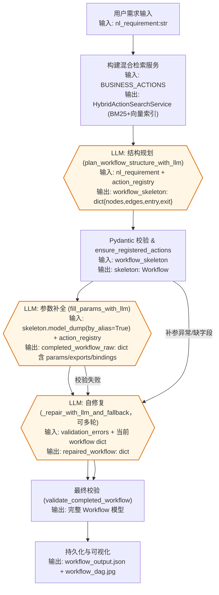

# VelvetFlow

VelvetFlow 是一个可复用的 LLM 驱动工作流规划与执行演示项目。项目包含混合检索、两阶段 LLM 规划（结构 + 补参）、静态校验与自修复、参数绑定 DSL、可模拟执行器与 DAG 可视化，帮助从自然语言需求自动构建并运行业务流程。

## 项目结构
```
VelvetFlow (repo root)
├── velvetflow/
│   ├── action_registry.py       # 从 business_actions.json 读取动作，附加安全元数据
│   ├── bindings.py              # 参数绑定 DSL 解析/校验
│   ├── business_actions.json    # HR/OPS/CRM 等示例动作库
│   ├── config.py                # 默认 OpenAI 模型配置
│   ├── executor.py              # 动态执行器，支持条件/循环/聚合导出
│   ├── logging_utils.py         # 终端友好日志 & 事件日志
│   ├── loop_dsl.py              # loop 节点 exports 输出 Schema 辅助
│   ├── models.py                # Workflow/Node/Edge 强类型模型与校验
│   ├── planner/                 # 结构规划、补参、校验与自修复模块
│   ├── search.py                # Fake ES + 内存向量库的混合检索服务
│   ├── simulation_data.json     # 执行动作的模拟返回模板
│   └── visualization.py         # 将 workflow 渲染为 JPEG DAG
├── workflow_fc_hybrid_actions_demo.py # 端到端生成 + 可视化示例入口
├── execute_workflow.py                 # 从已保存 JSON 执行 workflow
└── LICENSE
```

## 核心能力
- **业务动作注册表**：`action_registry.py` 从 `business_actions.json` 载入动作，自动补齐 `requires_approval` / `allowed_roles` 安全字段，并提供 `get_action_by_id` 查询。
- **混合检索**：`search.py` 提供 `FakeElasticsearch`（基于关键词计分）、`VectorClient`（余弦相似度）以及 `embed_text_openai`。`HybridActionSearchService` 将 BM25 与向量分数归一化后加权融合，返回动作候选。
- **工作流规划 Orchestrator**：`planner/orchestrator.py` 实现两阶段 `plan_workflow_with_two_pass`：
  - 调用 `planner/structure.py` 使用 OpenAI tool-calling 规划结构，并通过覆盖度检查、自动补边/修补循环 exports、审批节点检查等提升连通性与完备性。
  - 使用 `planner/params.py` 补全必填参数（含参数绑定示例），若失败则进入 `planner/repair.py` 与 `planner/action_guard.py` 的 LLM 自修复与动作校验。
  - `planner/validation.py` 做最终静态校验（必填字段、节点连通性、Schema 对齐）；失败则多轮调用修复直到通过或达到上限。
- **DSL 模型与校验**：`models.py` 定义 Node/Edge/Workflow，并校验节点类型、边引用合法性、loop 子图 Schema 等；提供 `ValidationError` 以在修复阶段统一描述错误。
- **参数绑定 DSL**：`bindings.py` 支持 `__from__` 引用上游结果，`__agg__` 支持 `identity/count/count_if/format_join/filter_map/pipeline`，并校验引用路径是否存在于动作输出/输入或 loop exports。
- **执行器**：`executor.py` 的 `DynamicActionExecutor` 会先校验 action_id 是否在注册表中，再执行拓扑排序确保连通；支持 condition 节点（如 list_not_empty/equals/contains/greater_than/between 等）与 loop 节点（body_subgraph + exports.items/aggregates 收集迭代与聚合结果），并结合 `simulation_data.json` 模拟动作返回。日志输出使用 `logging_utils.py`。
- **可视化**：`visualization.py` 提供 `render_workflow_dag`，支持 Unicode 字体回退，将 Workflow 渲染为 JPEG DAG。

## 使用方法
1. **安装依赖**
   ```bash
   python -m venv .venv
   source .venv/bin/activate
   pip install --upgrade openai numpy pillow pydantic
   ```
2. **设置凭证**
   ```bash
   export OPENAI_API_KEY="<your_api_key>"
   ```
3. **运行端到端示例**
   ```bash
   python workflow_fc_hybrid_actions_demo.py
   ```
   - 按提示输入自然语言需求（或直接回车使用默认示例），程序将构建混合检索服务、两阶段规划工作流，并打印最终 DSL。
   - 结果会持久化到 `workflow_output.json`，并生成 `workflow_dag.jpg`。
4. **从已保存 JSON 执行工作流**
   ```bash
   python execute_workflow.py --workflow-json workflow_output.json
   ```
   - 执行器会解析绑定 DSL、运行条件/循环节点，并使用 `velvetflow/simulation_data.json` 生成模拟结果。
5. **从 JSON 绘制工作流 DAG**
   ```bash
   python render_workflow_image.py --workflow-json workflow_output.json --output workflow_dag.jpg
   ```
   - 读取已有的 workflow JSON，将 DAG 渲染成 JPEG。对于 action 节点，会额外显示调用的工具名称和输入参数。
6. **校验任意 workflow JSON（可选）**
   ```bash
   python validate_workflow.py path/to/workflow.json --action-registry velvetflow/business_actions.json --print-normalized
   ```
   - 复用规划阶段的静态规则与 Pydantic 校验，输出详细错误；`--print-normalized` 可打印归一化后的 DSL。

## 工作流构建流程（含 LLM 标注）
下面先将原本的一步式描述拆分为更细的流水线，再用流程图展示端到端构建：

1. **需求接收与环境准备**：获取自然语言需求，并加载业务动作库以初始化混合检索服务。
2. **结构规划（LLM）**：调用 `plan_workflow_structure_with_llm` 生成 `nodes/edges/entry/exit` 骨架，随后用 Pydantic 校验与 `ensure_registered_actions` 过滤不合法动作。
3. **参数补全（LLM）**：在已通过的骨架上调用 `fill_params_with_llm` 补齐各节点 `params/exports/bindings`，生成完整的工作流字典。
4. **多轮校验与自修复（LLM）**：
   - 首次校验未通过时，记录 `ValidationError` 列表。
   - 进入 `_repair_with_llm_and_fallback`，结合错误提示反复修复，必要时回退到上一次有效版本，直到通过或达到 `max_repair_rounds`。
5. **持久化与可视化**：最终通过校验后，写出 `workflow_output.json`，并可用 `render_workflow_image.py` 生成 `workflow_dag.jpg`。

下方流程图标明关键输入/输出与 LLM 节点：



LLM 相关节点说明：
- **结构规划**：基于自然语言需求与动作 schema，生成 `nodes/edges/entry/exit` 的骨架，必要时触发覆盖度补充与 loop exports 生成。
- **参数补全**：为每个 action/condition/loop 节点填充必需的 `params`、`exports` 与绑定表达式，模型由 `velvetflow.config.OPENAI_MODEL` 控制。
- **自修复**：当校验失败或补参异常时，使用当前 workflow 字典与 `ValidationError` 列表提示模型修复，直到通过或达到 `max_repair_rounds`。

## 自定义与扩展
- **扩展动作库**：编辑 `velvetflow/business_actions.json` 增加/调整动作，`action_registry.py` 会自动加载并附加安全字段。
- **调优检索**：在 `workflow_fc_hybrid_actions_demo.py` 的 `build_default_search_service` 调整 `alpha` 或替换 `DEFAULT_EMBEDDING_MODEL`/`embed_text_openai` 以适配自定义向量模型。
- **更换模型**：`velvetflow/config.py` 中的 `OPENAI_MODEL` 控制规划/补参阶段使用的 OpenAI Chat 模型。
- **定制执行行为**：修改 `velvetflow/simulation_data.json` 模板以覆盖动作返回；如需调整条件/循环聚合规则，可在 `executor.py` 与 `bindings.py` 中扩展。

## 测试（可选）
- 仅进行语法检查可运行：
  ```bash
  python -m compileall velvetflow
  ```
