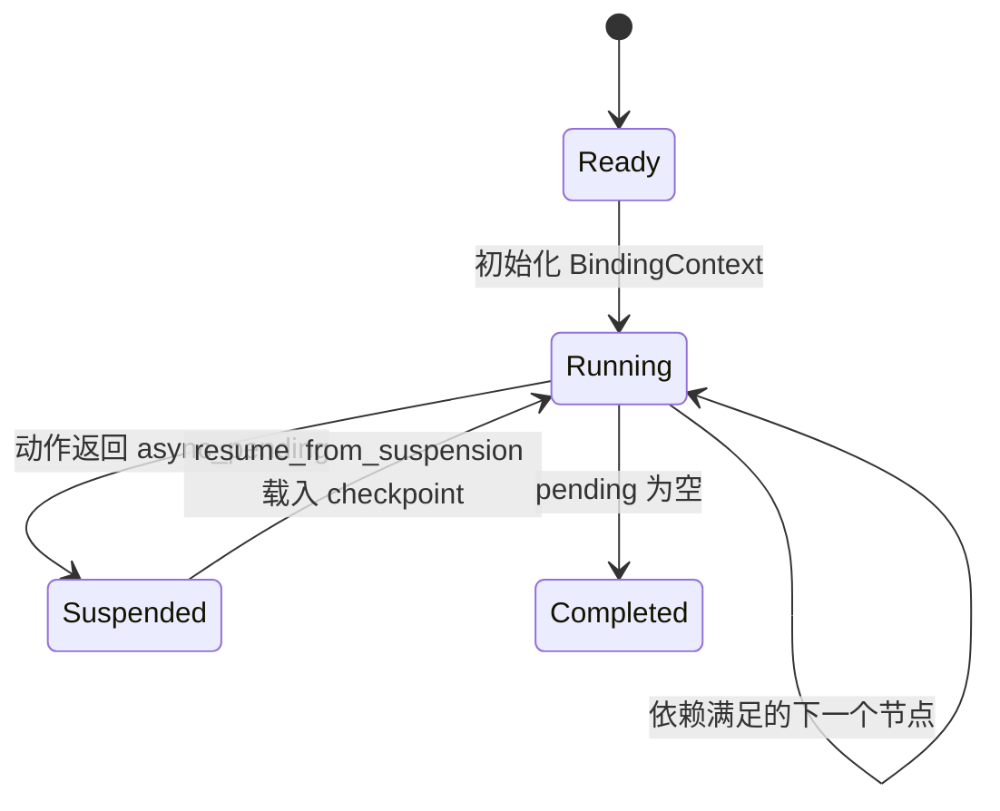

<!-- Language toggle tabs -->
<style>
.lang-tabs { border: 1px solid #d0d7de; border-radius: 6px; padding: 0.75rem; }
.lang-tabs input[type="radio"] { display: none; }
.lang-tabs label { padding: 0.35rem 0.75rem; border: 1px solid #d0d7de; border-bottom: none; border-radius: 6px 6px 0 0; margin-right: 0.25rem; cursor: pointer; background: #f6f8fa; font-weight: 600; }
.lang-tabs input[type="radio"]:checked + label { background: #fff; border-bottom: 1px solid #fff; }
.lang-tabs .tabs-body { border-top: 1px solid #d0d7de; padding-top: 0.75rem; }
.lang-tabs .tab-content { display: none; }
#internal-design-lang-zh:checked ~ .tabs-body #internal-design-tab-zh,
#internal-design-lang-en:checked ~ .tabs-body #internal-design-tab-en { display: block; }
</style>
<div class="lang-tabs">
<input type="radio" id="internal-design-lang-zh" name="internal-design-lang" checked>
<label for="internal-design-lang-zh">中文</label>
<input type="radio" id="internal-design-lang-en" name="internal-design-lang">
<label for="internal-design-lang-en">English</label>
<div class="tabs-body">
<div class="tab-content" id="internal-design-tab-zh">
# 内部实现与设计模式

## 模块分层
- **规划层（基于 Agent SDK）**：`planner/structure.py` 内联定义 Agent 工具完成需求拆解、节点构建与参数补全，`workflow_builder.py` 推导 edges/depends_on 并裁剪无关字段，`params_tools.py` 提供参数补全的 tool schema，`repair.py` 与 `orchestrator.update_workflow_with_two_pass` 提供自修复与增量更新，`orchestrator.py` 统筹 Action Guard、Jinja 规范化与修复循环，核心依赖由 `agent_runtime.py` 集中导出。
- **校验层**：`workflow_parser.py` 提供 DSL 的语法/语义解析与恢复建议，`verification/*` 与 `planner/repair_tools.py` 检查节点类型、引用路径与 Schema 兼容性，必要时自动填充默认值或清理非法字段。
- **执行层**：`executor` 包通过组合式 mixin 将动作调用、条件判断、循环展开、模板渲染与图遍历解耦，`dynamic_executor.py` 汇总后实现可挂起的执行主循环。

## 执行引擎图解
```mermaid
flowchart TD
    subgraph normalize[校验/归一化]
        V1[Workflow.model_validate] --> V2[infer_depends_on_from_edges]
    end
    subgraph runtime[动态执行]
        start[选择 start 节点] --> topo[拓扑排序 + depends map]
        topo --> loop[循环 body 执行]
        topo --> cond[条件/开关分支]
        topo --> act[业务动作调用]
        act -->|sync| next[更新 reachable]
        act -->|async_pending| suspend[构建 WorkflowSuspension\n(含 ExecutionCheckpoint)]
        suspend --> resume[resume_from_suspension]
        resume --> topo
        cond --> next
        loop --> next
        next --> metrics[记录日志与指标]
        metrics --> topo
    end
```

核心状态记录：
- `visited`：已完成节点；
- `reachable`：当前可调度节点集合；
- `blocked`：因条件未命中而冻结的分支；
- `pending_ids`：剩余拓扑顺序；
- `binding_snapshot`：`BindingContext` 的结果快照。

## 状态机生命周期


- `ExecutionCheckpoint` 将上述状态与 Workflow 序列化，配合 `WorkflowSuspension` 可写入/读取文件，便于外部异步工具回调后恢复执行。
- 恢复时 `resume_from_suspension` 会补齐上次节点的参数、重新构建拓扑并继续调度，无需重新初始化执行器。

## 设计模式与防御式策略
- **Mixin 组合**：`DynamicActionExecutor` 通过 `ActionExecutionMixin`、`LoopExecutionMixin`、`ConditionEvaluationMixin`、`TemplateRendererMixin`、`GraphTraversalMixin` 组合，保持各类节点处理逻辑独立且可测试。
- **Action Guard/Fail Fast**：初始化时 `_validate_registered_actions` 提前阻断缺失或未注册的 `action_id`，执行前的权限校验（`allowed_roles`）则阻止越权调用但不中断整个流程。
- **可重入执行**：异步节点挂起时将拓扑与绑定快照封装为 `ExecutionCheckpoint`，恢复时直接复用，保证执行器在多轮回调场景下保持幂等。
- **模板安全**：渲染前通过 `jinja_utils.py` 折叠常量并校验模板语法，避免运行期再暴露格式错误。

</div>
<div class="tab-content" id="internal-design-tab-en">
## Internal Design (English)
The internal design explains how planning, validation, and execution cooperate.

### Execution Engine and State Machine
- The executor transitions through **ready → running → suspended → resume → completed**, allowing multiple async suspensions. State snapshots (`ExecutionCheckpoint`) keep `visited`, `reachable`, `blocked`, and binding contexts for persistence and recovery.

### Orchestrator and Repair Flow
- `planner/orchestrator.py` runs `plan_workflow_with_two_pass` and incremental updates, chaining Action Guard, Jinja normalization/local repair, static validation, and LLM repair. Loop body references are pre-checked before parameter filling, and Action Guard whitelists `action_id` with retrieval-based replacement.

### Module Layers
- **Planner**: Requirement analysis, structure building, parameter completion, and repair on the Agent SDK (`planner/structure.py`, `params_tools.py`, `repair.py`).
- **Verification**: Shared validators across planning and execution (`verification/`).
- **Executor**: Dynamic execution with condition/loop support and suspension/resume (`executor/`).
- **Visualization & Tooling**: DAG rendering, action registry, search index, and logging utilities support end-to-end workflows.

</div>
</div>
</div>
