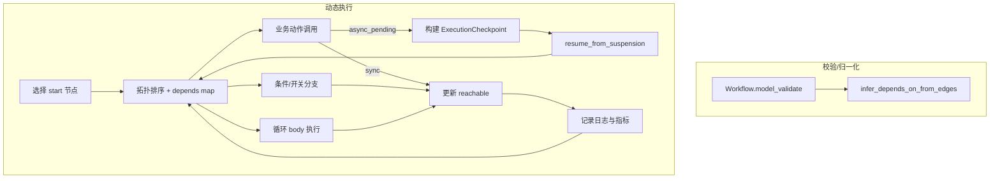

# 内部实现与设计模式

## 模块分层
- **规划层**：`planner/structure.py` 负责 tool-calling 生成骨架，`coverage.py` 提供覆盖度反馈，`orchestrator.py` 统筹补参、Action Guard、修复循环。
- **校验层**：`verification/validation.py`、`planner/repair_tools.py` 检查节点类型、引用路径与 Schema 兼容性，必要时自动填充默认值或清理非法字段。
- **执行层**：`executor` 包通过组合式 mixin 将动作调用、条件判断、循环展开、模板渲染与图遍历解耦，`dynamic_executor.py` 汇总后实现可挂起的执行主循环。

## 执行引擎图解

核心状态记录：
- `visited`：已完成节点；
- `reachable`：当前可调度节点集合；
- `blocked`：因条件未命中而冻结的分支；
- `pending_ids`：剩余拓扑顺序；
- `binding_snapshot`：`BindingContext` 的结果快照。

## 状态机生命周期

- `ExecutionCheckpoint` 将上述状态与 Workflow 序列化，配合 `WorkflowSuspension` 可写入/读取文件，便于外部异步工具回调后恢复执行。
- 恢复时 `resume_from_suspension` 会补齐上次节点的参数、重新构建拓扑并继续调度，无需重新初始化执行器。

## 设计模式与防御式策略
- **Mixin 组合**：`DynamicActionExecutor` 通过 `ActionExecutionMixin`、`LoopExecutionMixin`、`ConditionEvaluationMixin`、`TemplateRendererMixin`、`GraphTraversalMixin` 组合，保持各类节点处理逻辑独立且可测试。
- **Action Guard/Fail Fast**：初始化时 `_validate_registered_actions` 提前阻断缺失或未注册的 `action_id`，执行前的权限校验（`allowed_roles`）则阻止越权调用但不中断整个流程。
- **可重入执行**：异步节点挂起时将拓扑与绑定快照封装为 `ExecutionCheckpoint`，恢复时直接复用，保证执行器在多轮回调场景下保持幂等。
- **模板安全**：渲染前通过 `jinja_utils.py` 折叠常量并校验模板语法，避免运行期再暴露格式错误。
